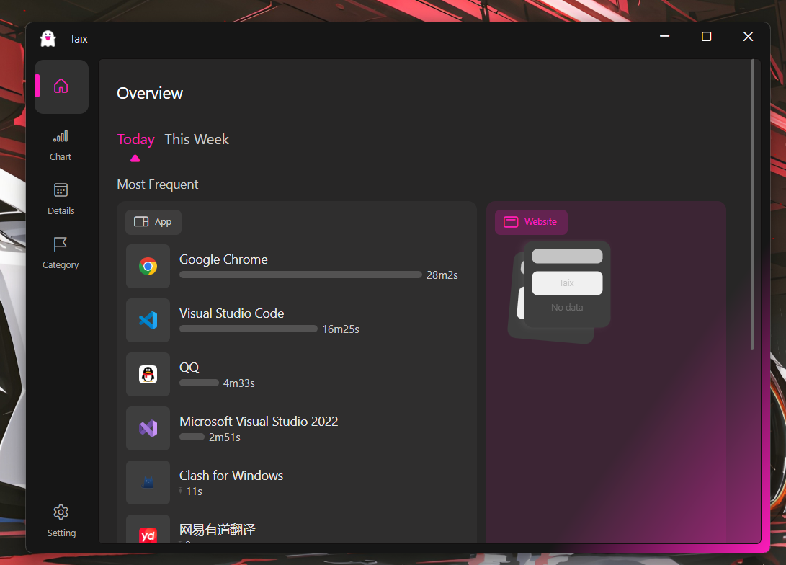

#### Introduction

First, thank the original author for open sourcing the project. The original project Tai is used to statistics the usage duration of `software` and `websites` on Windows.

Taix is a technical migration of [Tai](https://github.com/Planshit/Tai). It replaces WPF and .NET Framework with Avalonia and .NET 8. Currently, it only supports Windows. The purpose of this migration is twofold: one is to learn desktop development and Avalonia, and the other is to extend support to Linux and Mac. Additionally, I want to use this application to test future technologies.

#### Getting Started

## Learn More

#### Application Whitelist

Tai supports statistics for only the software listed in the whitelist. You can enable this feature in Settings > Behavior.

#### Associated Processes

If you want to record the usage duration of software on other screens when working with multiple screens, you can add the corresponding software processes to an associated list in the settings. Once added, using any software from the associated list will update the usage duration for all other software in the list, provided they are running (even in the background or without focus). A software process can only be associated once and cannot be associated with multiple other software processes.

#### Filtering Applications and Websites

You can filter out applications and websites that you do not want to include in the statistics by using process names/URLs or regular expressions in Settings > Behavior.

#### Data Storage and Export

Tai stores statistics data locally in an unencrypted `SQLite` database located at `运行目录\Data\data.db`. You can export the statistics data in `.xlsx` and `.csv` formats from the settings.

#### Sleep Monitoring

Tai can detect when the user is away from the computer and stop statistics. You can disable this feature in Settings > Behavior to achieve uninterrupted statistics.

#### Automatic Classification

It can automatically categorize software based on their running directories. When adding/editing categories in category management, you can enable or disable directory matching. For example, if you enable and add a directory `C:\` in `Category A`, then all software under the C drive will be automatically categorized into `Category A`.

#### Networking and Privacy

Tai makes no other network requests except when checking for updates or upgrading software (which requires you to manually check for updates in the settings). Tai does not collect or upload any of your information.
