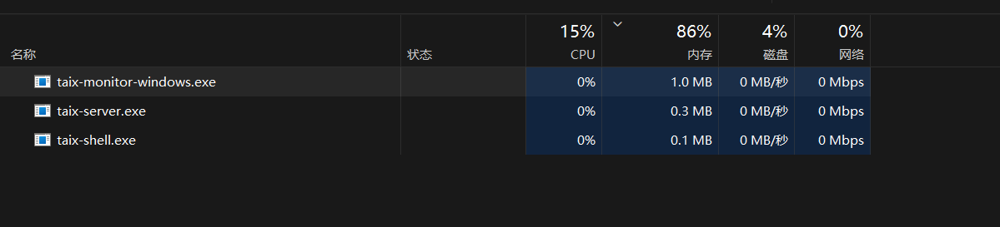
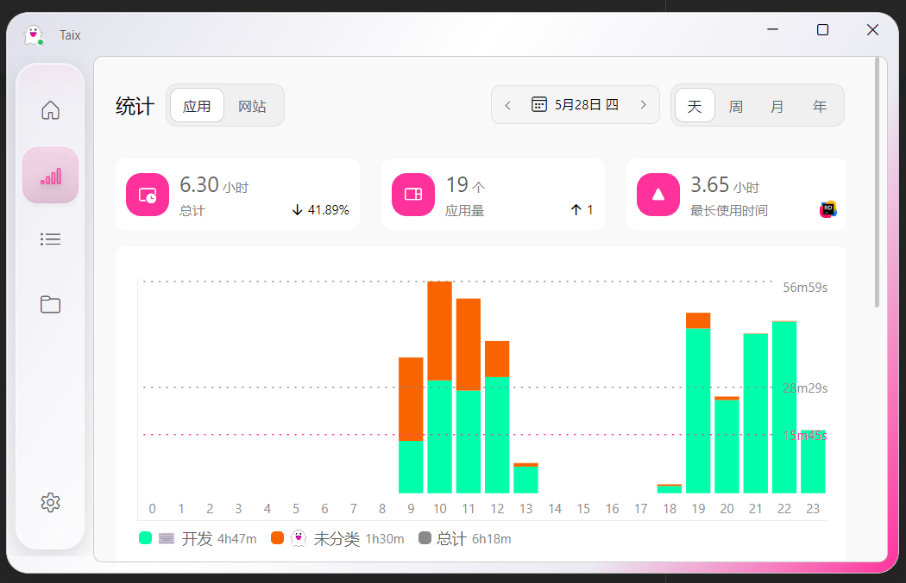
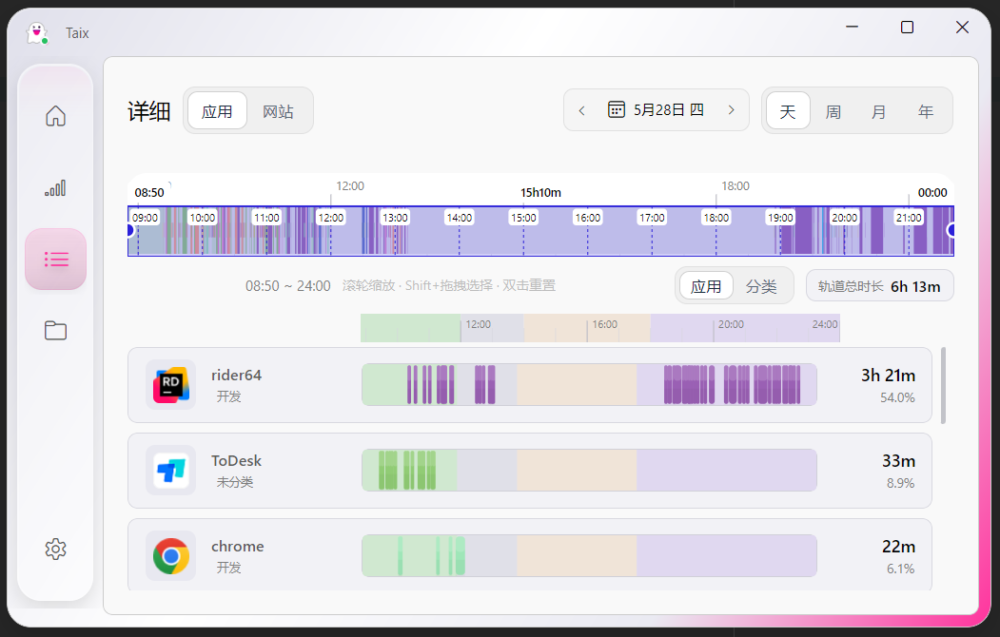

# 项目介绍

首先感谢原作者的开源，原项目 Tai 是用于在 Windows 上统计**软件**使用时长和**网站**浏览时长。

Taix 是 [Tai](https://github.com/Planshit/Tai) 的一次技术及架构的全面迁移：

- 当前客户端已完成对 .NET 10 AOT 和 Avalonia 12.0 的迁移
- 已实现客户端与服务端的分离
- 服务端采用 Rust 进行全面重写，采用更高效准确的计时方案，资源占用可以忽略不计

## 项目进展

自 1.2.0 版本开始，已对客户端全面重构并实现 UI 与服务彻底分离：

- 客户端已进行 AOT 发布
- 后台服务彻底使用 Rust 重写
- macOS 端即将作为架构副产品进行发布

### 协同组件

当前项目需要以下组件进行协同：

| 组件 | 说明 |
|------|------|
| taix-shell | 创建客户端托盘，方便唤醒客户端并起到看门狗作用，协同 server 与 monitor 应用，做到客户端随用随关 |
| taix-server | 提供数据访问接口，接收浏览器插件和平台计时统计数据并写入 SQLite |
| taix-monitor | 监控应用睡眠及焦点切换，使用命名管道对 server 进行通讯 |

> 由于来自 1.2.0 起大规模重构，目前 UI 会存在一些未发现或已知 bug。

### 运行表现

3 个应用协作长期运行下的内存情况：

## 数据兼容

- 在 1.2.0 前支持 Tai 最新版本的 db 文件
- 1.2.0 及后的新版本暂不确定
- 值得说明的是，如果进行迁移需要做好 db 文件备份

## 部分界面

