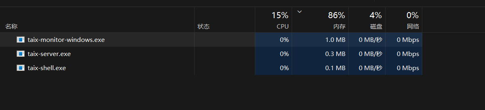
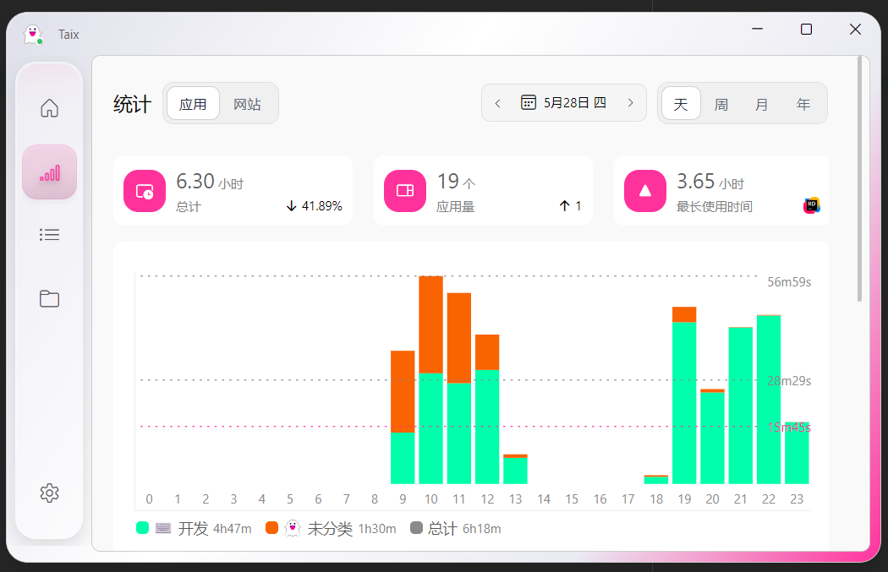
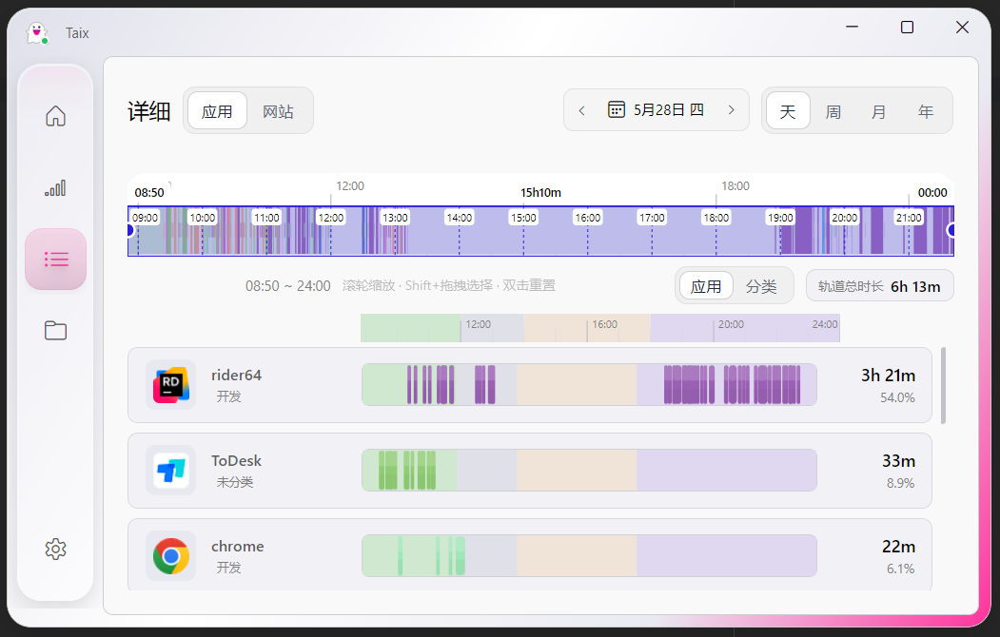

# 项目介绍

首先感谢原作者的开源，原项目 Tai 是用于在 Windows 上统计**软件**使用时长和**网站**浏览时长。

Taix 是 [Tai](https://github.com/Planshit/Tai) 的一次技术及架构的全面迁移：

- 当前客户端已完成 .NET 10 AOT 和 Avalonia 的迁移
- 已实现客户端与服务端的分离
- 服务端采用 Rust 进行全面重写，采用更高效准确的计时方案，资源占用可以忽略不计

### 协同组件

当前项目需要以下组件进行协同：

| 组件 | 说明 |
|------|------|
| taix-shell | 创建客户端托盘，方便唤醒客户端并起到看门狗作用，协同 server 与 monitor 应用，做到客户端随用随关 |
| taix-server | 提供数据访问接口，接收浏览器插件和平台计时统计数据并写入 SQLite |
| taix-monitor | 监控应用睡眠及焦点切换，使用命名管道对 server 进行通讯 |

后台进程统一由 taix-shell 看门狗管理，**不要手动单独启动** taix-server 与 taix-monitor：taix-shell 会读取睡眠监控配置并通过 `--sleep-watch` 参数传给 taix-monitor，手动启动的进程既不受看门狗守护，也缺失该参数。

### 常见问题

#### 客户端提示「无法连接到服务端」

本质是后台进程没在运行。正常情况下 taix-server 与 taix-monitor 由 taix-shell 看门狗自动拉起并守护，**只需确保 `taix-shell` 在运行即可**（为何不要手动启动见「协同组件」）。若 server 自身异常（如端口被占用、数据库损坏）导致启动即退出，看门狗虽会自动重试（间隔 5 秒起、退避至最长 30 秒），但服务始终不可用，此时应从 server 日志定位根因。

- **开机自启失效**：Windows 检查任务计划中 **TaixShell** 任务的路径是否与安装目录一致；Setup 安装器与绿色版均可用管理员终端 `taix-shell install` 补注册。macOS 则运行 `/Applications/TaixTools/install-launchagent.sh`（DMG 中 `TaixTools/` 即后台组件与安装脚本集合）
- **端口占用**：server 默认占 `127.0.0.1:37091`、浏览器扩展 WebSocket 占 `8908`。若 37091 被占用，可设置环境变量 `TAIX_SERVER` 换端口（如 `http://127.0.0.1:37100`，客户端与 server 均读取该变量）。server 日志按 `taix-server.YYYY-MM-DD.log` 按天滚动：Windows 在安装目录 `Logs\`，macOS 在 `/Applications/TaixTools/Logs/`

### 运行表现

3 个应用协作长期运行下的内存情况：

## 对Tai数据兼容

- 在 1.2.0 前支持 Tai 最新版本的 db 文件，1.2.0 及后的新版本暂不确定。不过当前程序有对旧版数据有较为完整的数据迁移步骤，理论上是支持的
- 值得说明的是，如果进行迁移需要做好 db 文件备份

## 部分界面

