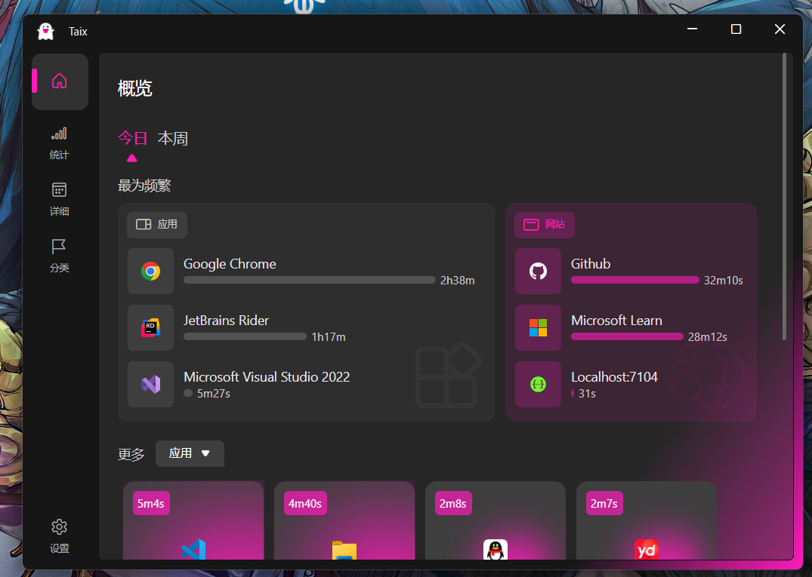

#### 项目介绍

首先感谢原作者的开源，原项目Tai 是用于在 Windows 上统计 `软件` 使用时长和 `网站` 浏览时长

Taix是[Tai](https://github.com/Planshit/Tai)对一次技术迁移。由wpf ,.netframework 更换为Avalonia ,.net8，目前仅支持windows。这次迁移的目的一方面目是用来学习桌面端开发和avalonia，还有就是我想以此去实现对Linux和Mac的支持，并且想以此应用作为以后一些技术的测试。

### 开始使用

#### 数据迁移

如果你已经在使用Tai了想尝试这个应用，可以直接将Tai目录下的Data/data.db文件直接复制到Taix Data/目录下。并且可以将AppIcons目录一同替换。

#### 使用

1. 在 [releases](https://github.com/NLick47/Taix/releases) 中可以下载已经编译好的 exe 可执行文件压缩包。建议优选选择标记有 `Latest` 的版本，划到下方的 `Assets` 找到 `Taix.x.x.x.zip` 点击下载；
2. 下载压缩包后解压到合适的位置（建议不要解压到桌面、系统盘），进入解压后的文件夹内，找到 `👻Tai.exe` ，启动程序，成功启动后你将在状态栏看到 👻 图标；
3. 使用 `网站浏览统计` 功能需要安装相应的浏览器拓展并且在 设置 > 常规 > 功能中启用。[下载安装浏览器插件说明](https://github.com/Planshit/Tai/discussions/279);
4. 请以管理员身份运行 Tai ，否则无法统计部分软件。

#### 卸载

1. 在设置中停用开机自启动（如果启用了）；
2. 删除所有文件即可完成卸载。

#### 基本操作

鼠标双击图标进入程序主界面，右击显示菜单。

## 了解更多

#### 为什么使用 Tai？

帮助你了解自己把时间花在了什么地方，从而更好地做一些计划。或者，为了每周回顾自己的摸鱼成果。~~工作只是换取薪酬，摸鱼才是赚钱。~~

#### 应用白名单

支持仅统计白名单内的软件，在设置 > 行为中可以启用此功能。

#### 关联进程

如果你希望在多屏工作时将其他屏幕所使用的软件同时记录使用时长，可以在设置中将相应的软件进程添加到一个关联列表中。添加完成后，只要使用了关联列表的其中一个软件，就会同步更新使用时长到列表里的其他软件上，但前提是其他软件需要正处于运行中（即使在后台或者没有焦点都行）。一个软件只能关联一次，不能重复与其他软件关联。

#### 过滤应用和网站

可以在设置 > 行为中通过进程名称/URL或者正则表达式对不需要统计的软件/网站进行过滤。

#### 数据储存和导出

Tai 使用不加密 `SQLite` 数据库将统计数据存储在本地 `运行目录\Data\data.db` 中。可以在设置中将统计的数据以 `.xlsx` 和 `.csv` 两种文件格式导出。

#### 睡眠监测

Tai 能够一定程度地发现用户离开电脑从而停止统计，也可以在设置 > 行为中停用此功能以实现不间断统计。

#### 自动分类

可以根据运行目录自动归类，在分类管理中添加/编辑分类时可以启用或关闭目录匹配。比如在 `分类A` 中启用并添加了一个目录 `C:\` ，那么C盘下所有软件都会被自动归类到 `分类A` 中。

#### 联网和隐私

除了检查更新/升级软件时（需要主动在设置中检查更新）之外完全没有其他网络请求。Tai 并不会收集和上传你的任何信息。

## Taix之后的任务

1. 完成多语言切换
2. Aot发布
3. linux X11 时长统计实现
4. Macos 时长统计实现

这个是我的一个想法，但大概是不会去进行实现了：

将应用拆分为UI与后台服务，UI数据通过grpc的方式向后台服务获取。服务可以采用c++或go进行实现，尽最大可能去缩小内存占用